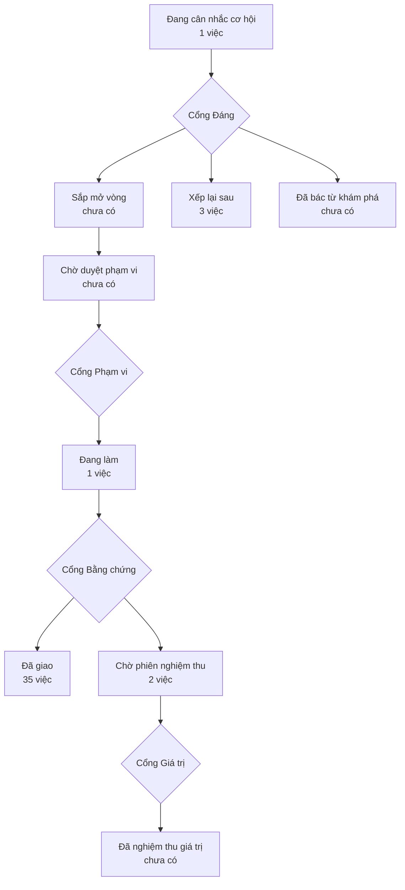

# Bản đồ sản phẩm

> Bản đồ vẽ lại từ hồ sơ của xưởng mỗi lần một người ký một cổng — đừng sửa tay.
> (đọc từ thư mục `_acceptance/` và `.out-of-scope/`)

> **Bốn cổng người** — mỗi cổng là một câu hỏi chỉ người trả lời được:
> **Cổng Đáng** việc này có đáng làm không · **Cổng Phạm vi** bộ tiêu chí
> đã đủ và đúng chưa · **Cổng Bằng chứng** đã làm đúng thứ đã hứa chưa ·
> **Cổng Giá trị** thứ đã giao có ăn thua không.

## Đang cân nhắc cơ hội

- Skill (`skill-1-footage-kho-clip`)

## Đang làm

- Mở hoá B01 — hạ cánh nhánh đổi định danh kho (ba README, NOTICE, SECURITY, CONTRIBUTING, CLAUDE.md, .github, docker-compose trỏ ảnh của fork, tắt trigger tag desktop-release) (`mo-hoa-b01`)

## Đã giao — chờ phiên nghiệm thu

- Lát cắt chứng minh — kế hoạch hợp nhất, luật đóng băng và guard (`lat-cat-chung-minh`)
- Nối hai thước tài-liệu-sống ↔ manifest vào CI (`noi-thuoc-tai-lieu-vao-ci`)

## Đã giao

- Node nạp-từ-kho — tìm trong media-library và nạp một asset về kho file thành file_key (`add-media-library`)
- BYO-key onboarding — first run reaches a real result before asking for a key (`byo-key-onboarding`)
- Cache L1 — node_fingerprint() and digest_form(), pure key computation (`cache-l1-fingerprint`)
- Cache L2 — on-disk node cache, tier A only (`cache-l2-store`)
- Cache L3 — tier B, per-workflow memo for nondeterministic slots (`cache-l3-tier-b`)
- Cache L4 — LRU eviction theo dung lượng, purge, reuse API, telemetry % partial (`cache-l4-eviction`)
- chống đọc sai êm ru — bộ đọc phải TỪ CHỐI thay vì phát ra nội dung sai (`chong-doc-sai-em-ru`)
- Chống mất khoá BYO — kho khoá từ chối ghi đè khi không đọc được, thay vì giả dạng rỗng (`chong-mat-khoa-byo`)
- Chống mất khoá BYO — nửa giao diện: màn Cài đặt và hai ô nhập khoá nói rõ kho hỏng và chặn ghi đè (`chong-mat-khoa-byo-giao-dien`)
- CI actions bump — actions/checkout 4→7, docker/login-action 3→4 (`ci-actions-bump`)
- CI-a — vitest vào CI + gỡ ghim SDK cứng của guard overlay (khử mìn hạ tầng verify) (`ci-vitest-sdk-pin`)
- slot dán chữ/khung giá/logo/safe-zone lên ảnh & video (Phase 1.2) (`compose-overlay`)
- Conformance L0 — pluginRev, node_cached contract, TS↔Python conformance suite (`conformance-l0`)
- Cổng tự canh mình — hai guard vào CI, và suite verify thôi tự đốt vòng (`cong-tu-canh-minh`)
- Đăng ký fork oneflow-api-openai vào manifest chính thức (`dang-ky-fork-openai`)
- Dependency refresh — five pending dependabot updates (`dependency-refresh-2026-07`)
- Gate 0.6 — cùng-không-gian cho scope paths + neo lịch sử cho eval per-PR (`gate-scope-anchors`)
- Gate tooling × t1_skip_globs — đường hợp lệ để sửa guard, và trả ba nợ 0.8 (`gate-tooling-t1`)
- Hàng rào thôi đọc nhầm "không đo được" thành "không có gì sai" (`hang-rao-doc-nham-loi-thanh-khong-co-gi`)
- Kho khoá toàn vẹn — đọc không cắt bớt âm thầm, ghi không để lại file cụt (`kho-khoa-toan-ven`)
- Không nói sai về kho khoá — server kiểm tiền đề của lệnh thay-kho, client phân loại lỗi đọc dương cả hai chiều (`khong-noi-sai-ve-kho-khoa`)
- Local CPU plugins — ffmpeg and pyscenedetect off Modal (`local-cpu-plugins`)
- Measurement harness — Whisper-vi WER, blind TTS rating, per-node COGS (`measure-harness`)
- slot đọc số/giá/ngày thành chữ tiếng Việt, bắt buộc đứng trước TTS (Phase 1.3) (`normalize-text-vi`)
- Ô đo chạy 0 ca thử mà vẫn báo đạt — hàng rào ở chốt CI (`o-do-chay-0-ca-van-xanh`)
- Plugin directory prefix — accept oneflow-*, keep tongflow-* installable (`oneflow-plugin-prefix`)
- Per-plugin origin in the official manifest (`per-plugin-origin`)
- pnpm 11 build-script approvals — move to pnpm-workspace.yaml (allowBuilds) and unblock the verify toolchain (`pnpm-build-approvals`)
- Làm độ trôi eval sau re-pin tính được và bắt được (`repin-khong-chay-lai-eval`)
- Guard chống trôi docs/roadmap.md — ba kiểm A/B/C, răng tách theo case, nối pnpm roadmap:check (`roadmap-drift-guard`)
- The plugin scanner reports the reason it already has, instead of blaming entry.py (`scan-scope-diagnostics`)
- Plugin scanner reads imports by scope boundary, and says why a slot was skipped (`scan-with-block-imports`)
- Publish the SDK as oneflow-sdk while keeping the tongflow import package (`sdk-distribution-rename`)
- Scope evidence staleness by declared eval paths (`stale-scope-by-paths`)
- Per-task metering columns and measured plugin duration (`task-metering`)

## Xếp lại sau

- Director v2 — trí nhớ canvas, vá đồ thị, ước tính chi phí, option tự-chạy (`director-v2`)
- Chốt chặn có thể đang bỏ qua kiểm bằng chứng lỗi thời cho hồ sơ khai thiếu paths (`staleness-ho-so-thieu-paths`)
- Timeline như một cách nhìn trên đồ thị — sắp clip, trim, xuất phim dài (`timeline-view`)
