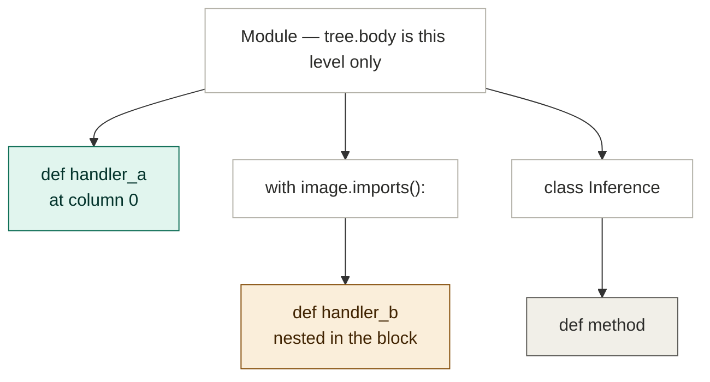

# Design: the plugin scanner reports the reason it already has

- **Slug:** `scan-scope-diagnostics`
- **Date:** 2026-08-18
- **Risk tier:** T3 (`sdk/**` is in `risk_tiers.t3_paths`)
- **Base:** stacked on `feat/scan-with-block-imports` @ `6e406f3` (the code this fixes
  exists only on that branch; it is unmerged and mid-S4, its round-2 evidence sitting at
  PENDING-JUDGMENT awaiting Gate 2)

## Problem

Every path below ends at the same sentence:

```
entry.py:1: no @node_slot(NodeSlots.XXX) methods found;
fix: add @node_slot and Input/Output annotations to entry.py
```

That sentence is true only in the case it names: nothing was found *and nothing else
had anything to say*. In four other cases the scanner is holding a specific reason —
a line number, a method name, a syntax error — and throws it away in favour of the
generic line. The plugin author is then told to fix a file that may not even be the
one that is wrong.

This is the defect the `scan-with-block-imports` feature existed to remove, reappearing
in code paths that feature did not cover. Its own contract says so, under
"Việc tách ra hợp đồng riêng" and in the Known limits it shipped with.

### The four paths

**1. The diagnostic half decides module scope differently from the registration half.**
`scan.py:156` builds `module_level = {id(node) for node in tree.body}` — a one-level
identity set — and gates rejection reporting on it at line 166. The registration path
in the same function walks the whole tree with `ast.walk`. The two agree only when
nothing is nested, so the disagreement is invisible in the common case and appears
exactly for the idiom the parent feature just legalised:

```python
with image.imports():
    from tongflow.models.compose_overlay import ComposeOverlayInput, ComposeOverlayOutput

    @node_slot(NodeSlots.COMPOSE_OVERLAY)
    def compose_overlay(payload) -> ComposeOverlayOutput:   # missing input annotation
        ...
```

Well-formed, this registers. Malformed, `rejections` stays empty and the generic line
is emitted. No test in `sdk/tests/test_scan_scope.py` covers a `def` nested in a
module-level block — the gap is untested as well as unfixed.

The two halves see different trees. `ast.walk` descends the whole thing; the identity
set built from `tree.body` reaches only the first level:



`handler_a` is reached by both halves: it registers, and when malformed it is reported.
`handler_b` is reached by `ast.walk` but is absent from the `tree.body` set — so it
registers and, when malformed, says nothing. That asymmetry is the defect. `method` is
in neither, which is correct: methods on a `@deploy` class are the deploy parser's
business, and reporting them here too would make every healthy deploy-first plugin noisy.

**2. `scan.py:374` discards the deploy parser's error string.** `dscan, _derr =
parse_deploy_py(deploy_py)` throws away a fully-formatted message. `parse_deploy_py`
returns `(None, err)` for an unreadable `deploy.py`, a syntax error, and a slot claimed
twice across two `@deploy` classes. All three become the generic line.

**3. `parse_deploy.py:211` assigns where it should merge.** In the legacy `Inference`
branch, `slot_problems = legacy_slot_problems` replaces the reasons already collected
from `@deploy` classes. When a `@deploy` class that registered nothing sits beside a
separately-named `Inference` class, its reasons vanish.

**4. `_scan_methods_by_slot_in_file` swallows parse failures.** `except (OSError,
SyntaxError): return {}, set(), [], []`. A plain typo in `entry.py` — the single
likeliest authoring mistake — produces the generic line pointing at `entry.py`, which
is correct about the file and silent about the reason.

## Approach

**Decide "is this def in module scope" with the same boundary predicate the import
collector already uses, and give every "this file would not parse" message one
wording.** Five edits; both `scan.py` and `parse_deploy.py` already import from
`._ast_utils`, so the shared rules go there.

Registration behaviour is deliberately left alone. Only the diagnostic half changes.

### 1. `_ast_utils._walk_module_scope` hands back the scope openers

Today it skips `def` / `class` / `lambda` children entirely — no `take`, no recursion.
That is right for import collection but means the walker can never yield the
`FunctionDef` nodes the gate needs. The correction is one line, and it is the more
faithful reading of the docstring already there: a `def` **binds its own name in the
enclosing scope**, even though its body opens a new one.

```python
for child in ast.iter_child_nodes(node):
    if isinstance(child, (ast.FunctionDef, ast.AsyncFunctionDef, ast.ClassDef, ast.Lambda)):
        if isinstance(child, ast.stmt):   # binds its name HERE...
            take(child)
        continue                          # ...but its body is a different scope
    if isinstance(child, ast.stmt):
        take(child)
    _walk_module_scope(child, take)
```

`ast.Lambda` is an expression, not a statement, so it falls through the inner guard
and is simply skipped, as before.

`_collect_models_roots` is unaffected: its `take_import_stmt` acts only on `ast.Import`
and `ast.ImportFrom`, so being handed a `FunctionDef` is a no-op. The two existing
negative tests — `test_function_local_import_is_not_collected` and
`test_class_body_import_is_not_collected` — keep that honest.

### 2. `scan.py` builds the gate from that walker

```python
module_scope: set[int] = set()
_walk_module_scope(tree, lambda stmt: module_scope.add(id(stmt)))
```

replacing the `tree.body` identity set. Membership is only ever tested for
`FunctionDef` nodes, so the other statements the walker yields are harmless.

The set is built **once per file**, before the `ast.walk` loop — not per function. This
matters more than it looks: the parent branch has just memoised `_collect_models_roots`
with `@lru_cache` precisely because the boundary walk visits the whole tree, and calling
it per annotated function measured 4.07s against 0.04s on a synthetic plugin. A gate
built inside the loop would reintroduce that same O(functions x nodes) cost by a
different door. `_walk_module_scope` itself is unchanged by that commit, so the edit in
step 1 still applies as written; and since `take_import_stmt` ignores non-imports, the
cached `_collect_models_roots` answer is unaffected by handing it scope openers.

Registration keeps using `ast.walk`, so a class-body method is still *visited* and
still *not* reported — which is what the parent's AC-11 noise budget requires. Every
healthy deploy-first plugin keeps its handlers as methods on a `@deploy` class; those
are the deploy parser's business, and reporting them here too would make every such
plugin noisy.

### 3. One wording for "this file would not parse"

`parse_deploy_py` already words read and syntax failures; `_scan_methods_by_slot_in_file`
currently swallows the same two exceptions. Rather than add a second phrasing, both call
one helper in `_ast_utils`:

```python
def parse_failure_reason(exc: OSError | SyntaxError) -> tuple[int, str, str]:
    """(line, reason, hint) for a file that could not be read or parsed."""
```

`parse_deploy_py`'s existing hint mentions `deploy.py` by name; generalised to the
file being read, one sentence serves both readers.

The scanner returns the message in its `rejections` slot. That slot already means
"a specific reason that outranks the generic line": it routes into `errors`, and the
existing `if not rejections:` guard suppresses the generic message. No new suppression
logic is introduced — the fix reuses the mechanism the parent feature built.

### 4. `scan.py:374` keeps the error

```python
dscan, derr = parse_deploy_py(deploy_py)
if derr:
    rejections.append(derr)
    errors.append({"pluginId": plugin_id, "message": derr})
if dscan:
    ...
```

`derr` arrives pre-formatted. `derr` and `dscan` are handled independently so the
docstring's "scan may still be partial" promise stays true if that ever becomes so.

### 5. `parse_deploy.py:211` extends with dedupe

```python
for problem in legacy_slot_problems:
    if problem not in slot_problems:
        slot_problems.append(problem)
```

Dedupe is not decoration — it is the whole difficulty. In the **common** shape the
`@deploy` class *is* named `Inference`, so `_parse_deploy_classes` and the legacy loop
parse the same class and produce identical `(lineno, reason)` tuples. Overwriting hides
that; a naïve `.extend()` would fix the rare shape and simultaneously report every
reason twice for every ordinary deploy-first plugin. Order-preserving dedupe on the
tuple gives both shapes the right answer, and the no-duplicate case needs its own
criterion or the cure ships as noise.

## Testing

New cases go in a new `sdk/tests/test_scan_diagnostics.py`, importing the parent's
fixture builders (`_write_abi`, `_write_plugin`, `_problems`) rather than copying them.
Two reasons to split rather than append: `test_scan_scope.py` is already 521 lines and
these additions would crowd the 800-line ceiling; and the parent package is mid-S4, so
leaving its test file untouched keeps its own measures exactly as verified. The idiom is
the parent's:

- A parametrized **ten-keyword matrix** for the rejection path, mirroring the existing
  `_BLOCKS` matrix built for imports — `with`, `if`, `elif`, `else`, `for`, `while`,
  `try`, `except`, `finally`, `match` — plus a **size-pinning test** so deleting a row
  shrinks the matrix loudly rather than silently.
- A **nested** case (`with` inside `if` inside `try`), matching the import matrix.
- **Negative boundaries**: a closure and a class-body method both stay quiet. Without
  these the fix could degrade into reporting everything, and the class-body case is the
  noise budget that makes the fix non-trivial.
- **Pinned messages**: every assertion names the shape that broke and the reason
  expected, not just an exit code.

Each new measure ships as a **two-way pair on one fixture**: the well-formed version
goes green, the same fixture mutated goes red with the reason named. A measure that has
never been red does not distinguish a healthy subject from a stick that never swung.

## Out of scope

Recorded rather than silently dropped:

- **The closure-registers mirror bug.** `ast.walk` registers a `@node_slot` `def`
  nested inside another `def`. `methods_by_slot` stores a bare method *name*, and a
  closure's name is not bound on the module, so the slot registers pointing at
  something nothing can resolve. Fixing it means changing registration, which this
  contract deliberately does not touch.
- **Class `@staticmethod` registration** via the directory scan. Zero occurrences in
  the repo, and real plugins live in gitignored `plugins/`, so no change here can be
  verified safe.
- **`@deploy` / `Inference` class discovery uses `tree.body`.** A handler class nested
  in a module-level block is invisible to *both* halves — consistently narrow rather
  than asymmetric — so widening it is registration-behaviour work, not this contract's.
