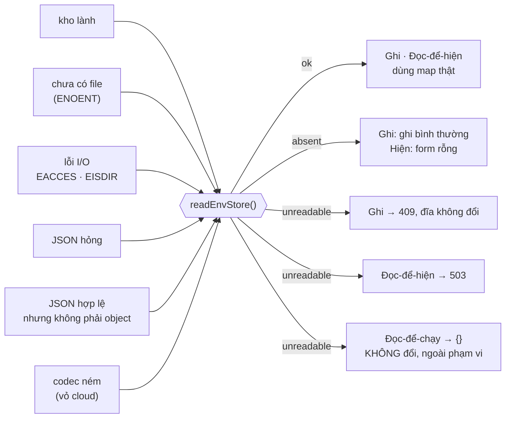
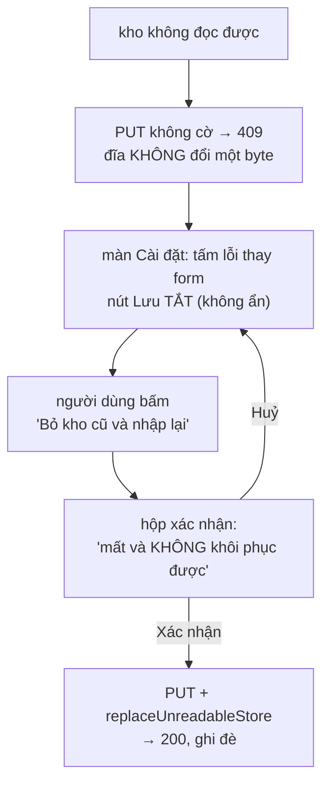

# Chống mất khoá BYO — thiết kế

> Ngày 31/08/2026 · slug `chong-mat-khoa-byo` · hạng T3
> Hợp đồng: [`_acceptance/chong-mat-khoa-byo/contract.md`](../../../_acceptance/chong-mat-khoa-byo/contract.md)

## 1. Vấn đề

Kho khoá BYO không phân biệt được **"chưa lưu khoá nào"** với **"không đọc được kho khoá"**.
Hai trạng thái đó phát ra cùng một tín hiệu, nên lần lưu kế tiếp xoá sạch mọi khoá cũ mà
không một câu thông báo.

Đo được trên `main` @ `b669b42`:

| Chỗ | Đo được |
|---|---|
| [`env-store.server.ts:40`](../../../src/lib/settings/env-store.server.ts) | `catch { return {} }` — mọi lỗi đọc/parse/decode thành map rỗng |
| [`env-store.server.ts:28-30`](../../../src/lib/settings/env-store.server.ts) | JSON hợp lệ nhưng **không phải object** (mảng/scalar) cũng trả `{}` |
| [`ext-default/settings-store.ts:23-25`](../../../src/ext-default/settings-store.ts) | `catch { return null }` **thứ hai** — lỗi I/O thật (EACCES, EISDIR, EIO) đã thành "chưa có file" **trước khi** lõi nhìn thấy |
| [`api/settings/env/route.ts:20`](../../../src/app/api/settings/env/route.ts) | GET trả map rỗng kèm **HTTP 200** — client không có cách nào biết |
| [`api/settings/env/route.ts:92-95`](../../../src/app/api/settings/env/route.ts) | PUT **thay toàn bộ** map bằng thứ client gửi lên |

Ba đường ghi đều là đọc-sửa-ghi, và đều gãy theo cách riêng:

| Đường ghi | Chốt chặn hiện có | Khi kho hỏng |
|---|---|---|
| [`settings-dialog.tsx:323-378`](../../../src/components/workspace/settings-dialog.tsx) | không có; `fetchEnv` chỉ `logger.error` | dựng map **từ form rỗng** → ghi đè bằng đúng thứ vừa gõ |
| [`abi-node-shell.tsx:107-118`](../../../src/components/workspace/nodes/base/abi-node-shell.tsx) | không có, **không cả kiểm `loaded.ok`** | `{...(current.env ?? {})}` → merge lên `{}` |
| [`media-library-config-panel.tsx:44-70`](../../../src/components/workspace/nodes/add/media-library-config-panel.tsx) | có, kiểm "là object" — comment tự khai đang chặn đúng lỗi này | `{}` **là** object hợp lệ → lọt qua |

Chốt chặn thứ ba không sai về ý định; nó **không thể** đúng, vì máy chủ đã bóp hai trạng
thái vào một hình dạng trước khi client nhìn thấy. Sửa phải bắt đầu từ phía máy chủ.

Nợ này đã ghi ở [`docs/roadmap.md`](../../roadmap.md) mục 1.3b như một lỗi mất dữ liệu
tách khỏi hồ sơ `add-media-library`. Nó nằm đúng trên đường BYO key mà
[ADR-0011](../../adr/0011-local-first-execution.md) đặt cược.

## 2. Đối chiếu ngành (đo tại chỗ 31/08, không dựa trí nhớ)

`git config` ghi một khoá vào file cấu hình hỏng:

```
error: invalid section name ''
error: invalid config file <path>
exit=3
```

— **từ chối ghi, và giữ nguyên nội dung cũ**: hai khoá `user.name` / `user.email` có sẵn
trong file vẫn còn nguyên sau lệnh. Đọc thì `git config --list` trên file hỏng trả
`fatal: bad config line 1`, exit 128 — không bao giờ báo "cấu hình rỗng".

`sqlite3` mở file không phải database: `Error: file is not a database (26)` — không báo
"database rỗng".

Đây là hành vi ta thiết kế theo: **nêu tên chỗ hỏng, từ chối, giữ nguyên dữ liệu cũ.**

## 3. Quyết định của owner (31/08)

1. Kho không đọc được → đường ghi **từ chối**, kèm **một đường thoát người dùng phải tự bấm**.
2. Phạm vi: nhóm **Ghi** + nhóm **Đọc-để-hiện**. Nhóm **Đọc-để-chạy** (`withStoredEnv`,
   `director.server.ts`) **giữ nguyên** — kho hỏng không được chặn lượt chạy node nào.
3. Đường thoát = **cờ tường minh trên PUT**; nút **chỉ** ở màn Cài đặt.
4. **Không giữ bản hỏng** trước khi ghi đè.

## 4. Phương án đã chọn, và hai phương án bị loại

| | Cách | Phán quyết |
|---|---|---|
| **A** | Bộ đọc **ba trạng thái** — union `ok / absent / unreadable`, trình biên dịch ép mọi nơi gọi phải quyết | **Chọn.** Khớp luật `CLAUDE.md` *"hợp đồng ép lúc biên dịch"*; nơi nào chọn "coi như rỗng" thì đó là một dòng mã có chủ ý |
| **B** | Ném lỗi cho `unreadable`, giữ `{}` cho `absent` | **Loại.** Ném lan tới `withStoredEnv` → mọi lượt chạy node đổ, tức tự động lật quyết định 2 |
| **C** | Hai bộ đọc riêng (một khoan dung, một nghiêm) | **Loại.** Hai nguồn logic đọc; người sau chọn nhầm là bug quay lại |

## 5. Kiến trúc

### 5.1 Seam — đổi hợp đồng, giữ chữ ký

[`src/ext-default/settings-store.ts`](../../../src/ext-default/settings-store.ts):

- `readSettingsBlob(): Promise<string | null>` — **chữ ký không đổi**, nên bản `src/ext/`
  của vỏ cloud (gitignored, dựng lúc build) vẫn biên dịch được.
- Hợp đồng mới: `null` **chỉ** nghĩa *chưa có*. Lỗi thật thì **ném**. Bản OSS bắt riêng
  `ENOENT` → `null`; mọi mã lỗi khác ném tiếp.

Không sửa chỗ này thì đường desktop **không bao giờ** phát hiện được trạng thái hỏng — đây
là chỗ nuốt lỗi thứ hai, nằm dưới chỗ ai cũng nhìn.

### 5.2 Lõi — một nguồn, ba trạng thái

[`src/lib/settings/env-store.server.ts`](../../../src/lib/settings/env-store.server.ts):

```ts
export type EnvStoreRead =
    | { state: "ok"; env: EnvStore }
    | { state: "absent" }
    | { state: "unreadable"; reason: string };

export async function readEnvStore(): Promise<EnvStoreRead>;
```

Bốn nguyên nhân quy về `unreadable`, mỗi cái mang `reason` máy-đọc-được:

| Nguyên nhân | Nguồn |
|---|---|
| `io` | seam ném (EACCES, EISDIR, EIO…) |
| `decode` | `decodeEnvStore` ném (vỏ cloud: sai khoá giải mã) |
| `parse` | `JSON.parse` ném |
| `shape` | JSON hợp lệ nhưng không phải object thuần |

`loadEnvStore()` **giữ tên**, thành lớp mỏng gọi `readEnvStore()` và quy cả `absent` lẫn
`unreadable` về `{}` — kèm chú thích nêu rõ đây là lựa chọn của nhóm *Đọc-để-chạy*, nằm
ngoài phạm vi vòng này. Nhờ vậy nhóm 3 giữ nguyên hành vi **mà không phải chạm file nào
của nó**, và quyết định 2 thành một dòng mã đọc được chứ không phải một điều phải nhớ.

| Nơi gọi | Dùng | Nhóm |
|---|---|---|
| `route.ts` GET + PUT | `readEnvStore` | Ghi + Đọc-để-hiện |
| `media-library/config.server.ts:24` | `readEnvStore` | Đọc-để-hiện |
| `withStoredEnv`, `director.server.ts:115` | `loadEnvStore` (khoan dung, có chú thích) | Đọc-để-chạy — **ngoài phạm vi** |

### 5.3 API

| Đường | Kho `ok` / `absent` | Kho `unreadable` |
|---|---|---|
| `GET /api/settings/env` | `200` như cũ (vắng = `{}` — vẫn đúng) | **`503`** `{ error, code: "ENV_STORE_UNREADABLE" }` |
| `PUT /api/settings/env` (không cờ) | ghi như cũ | **`409`**, **không ghi gì** |
| `PUT` + `replaceUnreadableStore: true` | *(cờ bị bỏ qua)* | ghi đè, `200` |

`503` cho GET vì đây là điều kiện của kho lưu trữ, không phải lỗi lập trình. `409` cho PUT
vì yêu cầu xung đột với trạng thái hiện tại của tài nguyên — và đó cũng là chỗ `git config`
đứng: từ chối, giữ nguyên.

Cờ đặt tên `replaceUnreadableStore` chứ không phải `force`: nó nói **điều kiện** nó cho
phép, nên đọc lại sau sáu tháng vẫn biết nó không phải cái búa chung.

## 5b. Hai hình tại điểm quyết định

**Hình 1 — sáu trạng thái kho, một bộ đọc, ba nhóm dùng.**



Ba mũi tên rời khỏi `unreadable` là toàn bộ phạm vi đã chốt: hai mũi đầu là việc
của vòng này, mũi thứ ba là quyết định **cố ý không đụng** (AC-4 canh nó).

**Hình 2 — đường thoát có ý thức, năm bước.**



Hai panel node dừng ở bước C và chỉ sang màn Cài đặt — chúng **không** có bước D.

<!-- <<<UX-SPEC-TEMPLATE -->
## Đặc tả UX

### 1. Luồng

- Suôn sẻ: mở Cài đặt → thấy danh sách khoá → sửa → Lưu (điểm ra: toast "đã lưu")
- Biên: kho **chưa có** (người dùng mới) → form rỗng bình thường, **không** phải trạng thái lỗi
- Lỗi & quay lại: kho **không đọc được** → form bị thay bằng tấm nêu lý do; Lưu tắt; một
  nút thoát duy nhất → hộp xác nhận → ghi đè. Ở hai panel node thì không có nút thoát,
  chỉ có câu lỗi + đường dẫn sang Cài đặt.

### 2. Kiểm kê màn

| Màn | MỘT việc của màn | Vào từ / ra tới |
|---|---|---|
| Cài đặt (`settings-dialog`) | quản lý toàn bộ khoá BYO | nút bánh răng trên thanh điều hướng / đóng hộp thoại |
| Panel cấu hình media-library | nhập **hai** khoá cho node nạp-từ-kho | node trên canvas / đóng panel |
| Ô khoá trong vỏ node ABI | nhập **một** khoá cho nhà cung cấp của node | node trên canvas / node chạy tiếp |

### 3. Bảng trạng thái

<!-- <<<UX-STATE-TABLE -->
| Trạng thái | Màn | Hiển thị gì | Người làm gì tiếp |
|---|---|---|---|
| ST-caidat-dangtai | Cài đặt | skeleton hàng khoá | chờ |
| ST-caidat-binhthuong | Cài đặt | danh sách khoá + nút Lưu bật | sửa, lưu |
| ST-caidat-chuacokhoa | Cài đặt | form rỗng, chữ dẫn "chưa có khoá nào" | nhập khoá đầu |
| ST-caidat-khodoc | Cài đặt | tấm lỗi **thay** form: "Không đọc được kho khoá đã lưu. Chưa có gì bị thay đổi." + lý do kỹ thuật thu gọn; nút Lưu **tắt**; một nút "Bỏ kho cũ và nhập lại" | bấm nút thoát, hoặc đóng đi tự gỡ |
| ST-caidat-xacnhan | Cài đặt | hộp xác nhận: "Mọi khoá đang lưu sẽ mất và không khôi phục được." | Huỷ / Xác nhận |
| ST-panelnode-khodoc | Panel media-library, ô khoá node ABI | câu lỗi + "Mở Cài đặt để xử lý"; nút Lưu **tắt** | sang Cài đặt |
<!-- UX-STATE-TABLE>>> -->

### 4. Hành vi

- Nút Lưu **tắt** (không phải ẩn) ở `ST-caidat-khodoc` — người dùng thấy nó tồn tại nhưng
  đang không dùng được, thay vì tưởng mình bấm nhầm chỗ.
- Hộp xác nhận là hệ quả trực tiếp của **quyết định 4** (không giữ bản hỏng): mất là mất
  hẳn, nên phải có một nhịp dừng. Nếu bỏ quyết định 4 thì bỏ được màn này.
- Lý do kỹ thuật (`reason`) hiện **thu gọn**, không phải stack trace: đủ để người dùng
  chép vào báo lỗi, không đủ để doạ.
- Copy mới vào đủ **5 locale** (`en/ja/ko/vi/zh`).

### 5. Xuất xứ component

| Component | Nấc | Vì sao |
|---|---|---|
| `ui/alert-dialog` | **dùng** | hộp xác nhận huỷ diệt — đã có sẵn trong repo |
| `ui/button` (`variant="destructive"`) | **dùng** | nút thoát |
| Tấm lỗi trong `settings-dialog` | **ghép** | `ui/card` + `ui/button`, không thêm component mới |
| Câu lỗi ở hai panel node | **dùng** | theo đúng lối hiện có của `media-library-config-panel` |

### 6. Khuôn IA đã chọn + căn cứ

Khuôn IA: **một-cột-cuộn**
Căn cứ: luồng hiển nhiên, không cần tra mẫu — đây không phải màn mới mà là **một trạng
thái thêm vào ba màn đã tồn tại**. Cả ba đều đã là một-cột-cuộn; đổi khuôn ở đây là đổi
màn sẵn có, nằm ngoài phạm vi.
<!-- UX-SPEC-TEMPLATE>>> -->

## 6. Cách đo

Mọi tiêu chí "từ chối" đo **hai chiều trên cùng một fixture** (điều khoản
`MEASURE-BIRTH-CLAUSE`): vật lành → thước xanh; phá vật thật trong bản sao → thước đỏ với
**thông điệp ghim**. Một phép đo chưa từng đỏ không phân biệt được "vật lành" với "thước
chưa bao giờ chạy".

Tiêu chí trọng tâm là **AC-6**: PUT không cờ vào kho hỏng phải trả 409 **và blob trên đĩa
không đổi một byte**. Đo bằng cách so nội dung file trước/sau — đúng phép đo đã chạy trên
`git config` ở mục 2, không phải chỉ assert mã trạng thái.

Ca `decode` chỉ đo được qua **seam giả lập**, vì codec thật của bản cloud không có trong
repo này.

## 7. Ngoài phạm vi

- **Giữ bản hỏng trước khi ghi đè** — quyết định 4; tách hợp đồng con có tên.
- **Nhóm Đọc-để-chạy dừng lượt chạy khi kho hỏng** — quyết định 2; đánh đổi vận hành khác
  hẳn (một file settings hỏng sẽ chặn cả node cục bộ không cần khoá nào).
- **Vỏ cloud tuân hợp đồng seam mới** — `src/ext/settings-store.ts` nằm ở repo khác.
- **Hiện số khoá sắp mất** — kho hỏng thì không đếm được; lợi ích mỏng hơn vẻ.
- **Hai tab cùng lưu** (idempotency/concurrent) — PUT vốn đã thay-toàn-bộ từ trước; lỗi
  này không sinh ra nó.
- **Mã hoá kho ở bản OSS** — codec là seam, để trống có chủ ý.
- **Role/quyền trên route settings** — bản OSS một tenant; thêm là đổi kiến trúc.
- **Versioning/migrate schema `settings.json`** — chưa có nhu cầu.

## 8. Giới hạn khai trước

1. **Nhánh vỏ cloud không kiểm được từ máy này.** `src/ext/` gitignored. Ta đổi được *hợp
   đồng* seam + bản OSS; nếu bản cloud vẫn nuốt lỗi thì đường cloud vẫn báo `absent`. Đây
   là giới hạn có thật của ranh giới repo, không phải thiếu sót của gói việc.
2. **Không có đường khôi phục.** Người dùng bấm thoát là mất khoá cũ thật. Hộp xác nhận là
   toàn bộ hàng rào.
3. **`loadEnvStore` vẫn nuốt `unreadable`** cho nhóm Đọc-để-chạy — có chủ ý, có chú thích,
   nhưng vẫn là một chỗ nuốt lỗi còn lại trong mã.
